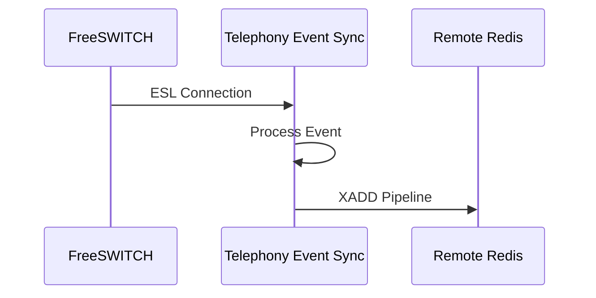
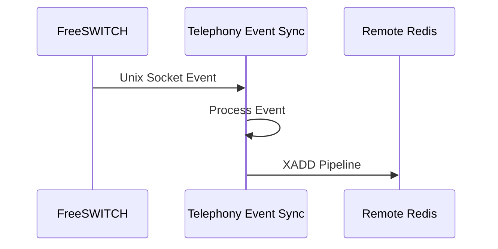
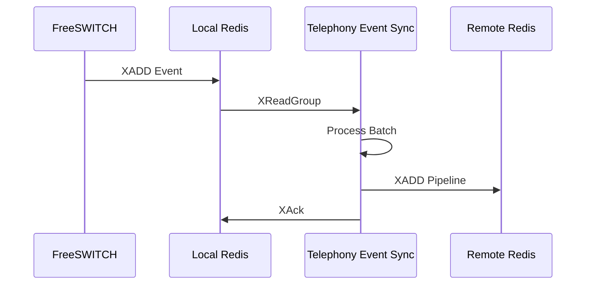
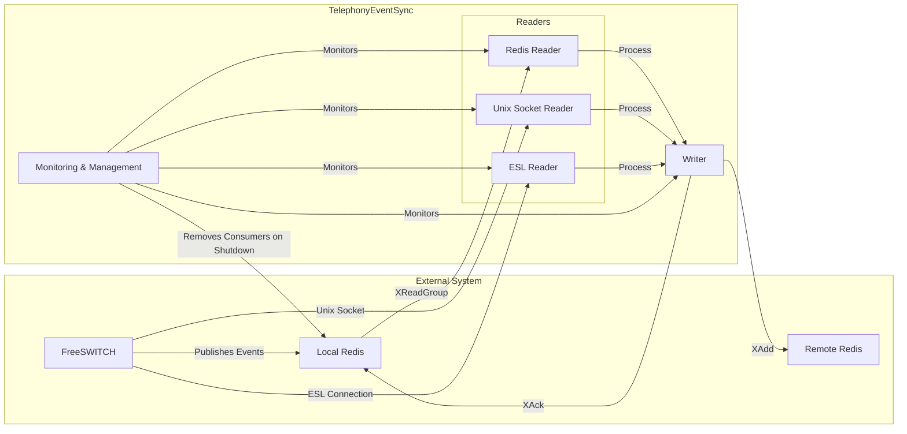
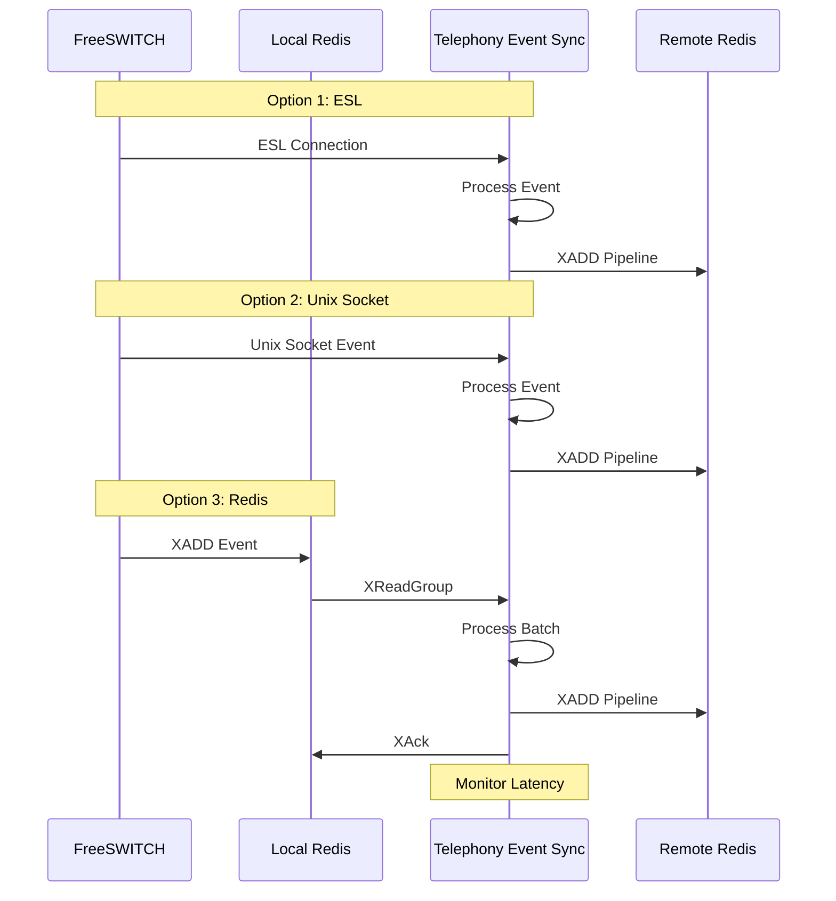
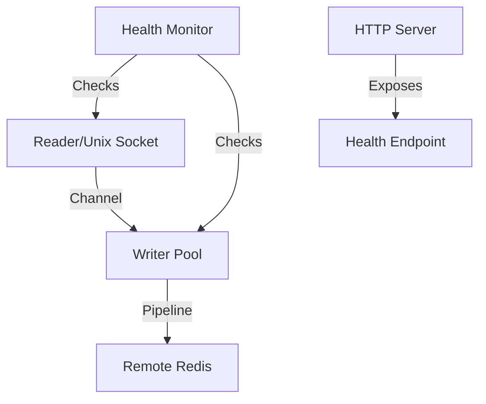

# Telephony Event Sync

High-performance telephony event synchronization service between Redis instances, optimized for low latency and high throughput.

## Reading Alternatives

The service supports three different ways to receive events from FreeSWITCH. Each approach has distinct characteristics that should be considered for your specific use case:

### 1. ESL (Event Socket Library) (Recommended)

In this mode, the service connects directly to FreeSWITCH using the Event Socket Library (ESL). This provides the most efficient and reliable connection to FreeSWITCH events, offering:

**Technical Characteristics:**

- Direct TCP connection to FreeSWITCH (port 8021)
- Native FreeSWITCH event format
- Automatic reconnection handling
- Real-time event delivery
- No intermediate storage



**Configuration Requirements:**

```env
READER_TYPE=esl
ESL_HOST=localhost
ESL_PORT=8021
ESL_PASSWORD=ClueCon
ESL_HEALTH_CHECK_TIMEOUT=3s
```

### 2. Unix Socket

In this mode, FreeSWITCH writes events directly to a Unix socket, which are then read by the service. This provides the lowest possible latency as it eliminates the Redis local step.



**Technical Characteristics:**

- Unix domain socket communication
- Custom event format
- File system based communication
- No network overhead
- Requires FreeSWITCH Lua script

**Configuration Requirements:**

```env
READER_TYPE=unix
UNIX_SOCKET_PATH=/var/run/telephony/telephony.sock
```

FreeSWITCH configuration (in `lua.conf.xml`):

```xml
<!-- GO CONTACT EVENTS -->
<hook event="BACKGROUND_JOB" script="send-events.lua"/>
<hook event="CHANNEL_EXECUTE" script="send-events.lua"/>
<hook event="CHANNEL_EXECUTE_COMPLETE" script="send-events.lua"/>
<hook event="CHANNEL_ANSWER" script="send-events.lua"/>
<hook event="CHANNEL_HANGUP" script="send-events.lua"/>
<hook event="DTMF" script="send-events.lua"/>
<hook event="DETECTED_SPEECH" script="send-events.lua"/>
<hook event="CUSTOM" subclass="fscontact::inbound" script="send-events.lua"/>
<hook event="CUSTOM" subclass="fscloud-tone-detection" script="send-events.lua"/>
<!-- GO CONTACT EVENTS -->
```

### 3. Redis Local

In this mode, FreeSWITCH writes events to a local Redis instance, which are then read by the service using Redis Streams. This mode is ideal for high-throughput scenarios where event ordering is critical.



**Technical Characteristics:**

- Redis Streams based communication
- JSON event format
- Persistent storage
- Consumer group support
- Batch processing capability

**Configuration Requirements:**

```env
READER_TYPE=redis
REDIS_LOCAL_ADDR=localhost:6379
REDIS_LOCAL_DB=2
REDIS_GROUP=sync_group
REDIS_CONSUMER=sync_worker
```

## Architecture

### System Overview



### Processing Flow



### Component Architecture



## Features

### Event Reading

- ESL (Event Socket Library) direct connection
- Unix Socket communication
- Automatic reconnection handling
- Event filtering capabilities
- Batch processing support

### Event Processing

- Low-latency event processing
- Parallel processing with multiple workers
- Comprehensive latency monitoring
- Protection against overload
- Automatic stream trimming
- Event ordering preservation

### Data Management

- Real-time event synchronization
- Event persistence (Redis mode)
- Stream length management
- Data loss prevention

### Monitoring & Management

- Health checks and metrics
- Latency monitoring
- Error tracking
- Resource usage metrics
- Graceful shutdown

## Requirements

- Go 1.21 or higher
- Redis 6.0 or higher
- FreeSWITCH with mod_event_socket

## Configuration

The service is configured through environment variables:

### Reader Configuration

```env
# Choose between "redis", "unix", or "esl" (default: "esl")
READER_TYPE=esl

# Unix Socket configuration (only used when READER_TYPE=unix)
UNIX_SOCKET_PATH=/var/run/telephony/telephony.sock  # Unix socket path

# ESL configuration (only used when READER_TYPE=esl)
ESL_HOST=localhost                # FreeSWITCH ESL host
ESL_PORT=8021                    # FreeSWITCH ESL port
ESL_PASSWORD=ClueCon            # FreeSWITCH ESL password
ESL_HEALTH_CHECK_TIMEOUT=3s     # ESL configuration check timeout
```

FreeSWITCH configuration (in `lua.conf.xml`) can be commented or removed since with this solution the scripts are not longer needed:

```xml
<!-- GO CONTACT EVENTS -->
<!-- <hook event="BACKGROUND_JOB" script="gocontact-event-publisher.lua"/> -->
<!-- <hook event="CHANNEL_EXECUTE" script="gocontact-event-publisher.lua"/> -->
<!-- <hook event="CHANNEL_EXECUTE_COMPLETE" script="gocontact-event-publisher.lua"/> -->
<!-- <hook event="CHANNEL_ANSWER" script="gocontact-event-publisher.lua"/> -->
<!-- <hook event="CHANNEL_HANGUP" script="gocontact-event-publisher.lua"/> -->
<!-- <hook event="DTMF" script="gocontact-event-publisher.lua"/> -->
<!-- <hook event="DETECTED_SPEECH" script="gocontact-event-publisher.lua"/> -->
<!-- <hook event="CUSTOM" subclass="fscontact::inbound" script="gocontact-event-publisher.lua"/> -->
<!-- <hook event="CUSTOM" subclass="fscloud-tone-detection" script="gocontact-event-publisher.lua"/> -->
<!-- GO CONTACT EVENTS -->
```

### Redis Local Configuration (only used when READER_TYPE=redis)

```env
REDIS_LOCAL_ADDR=localhost:6379    # Local Redis address
REDIS_LOCAL_DB=2                   # Local Redis database number
REDIS_LOCAL_PASSWORD=              # Local Redis password (if any)
REDIS_LOCAL_POOL_SIZE=100          # Local Redis connection pool size
REDIS_LOCAL_MIN_IDLE_CONNS=10      # Minimum idle connections in pool
REDIS_LOCAL_MAX_RETRIES=3          # Maximum retries for failed operations
```

### Redis Remote Configuration

```env
REDIS_REMOTE_ADDR=redis.qa-uc-cloud1.gocontact.internal:6379  # Remote Redis address
REDIS_REMOTE_DB=2                 # Remote Redis database number
REDIS_REMOTE_PASSWORD=            # Remote Redis password (if any)
REDIS_REMOTE_POOL_SIZE=100        # Remote Redis connection pool size
REDIS_REMOTE_MIN_IDLE_CONNS=10    # Minimum idle connections in pool
REDIS_REMOTE_MAX_RETRIES=3        # Maximum retries for failed operations
```

### Stream Configuration

```env
# Stream names
STREAM_EVENTS=freeswitch:telephony:events        # Main events stream
STREAM_JOBS=freeswitch:telephony:background-jobs # Background jobs stream

# Stream settings
EVENTS_MAX_LEN=10000              # Maximum length of events stream
JOBS_MAX_LEN=10000               # Maximum length of jobs stream
EVENTS_EXPIRE_TIME=10m           # Events expiration time
JOBS_EXPIRE_TIME=1m             # Jobs expiration time
TRIM_INTERVAL=10s               # Interval for stream trimming
```

### Processing Configuration

```env
# Reader configuration
READER_WORKERS=10                # Number of parallel reader workers
READER_BATCH_SIZE=1000           # Number of messages to read at once
READER_MAX_LATENCY=300ms         # Maximum acceptable read latency
READER_BLOCK_TIME=10ms           # Block time for ESL operations

# Buffer configuration
BUFFER_SIZE=100000               # Size of the channel buffer between reader and writers

# Writer configuration
WRITER_WORKERS=10                # Number of parallel writer workers
WRITER_PIPELINE_TIMEOUT=25ms     # Pipeline execution timeout
WRITER_BATCH_SIZE=10             # Number of messages per pipeline
WRITER_MAX_LATENCY=300ms         # Maximum acceptable write latency
TOTAL_MAX_LATENCY=1000ms         # Maximum acceptable total latency (from event to remote)
```

### Health Check Configuration

```env
HEALTH_CHECK_INTERVAL=5s         # Interval between health checks
HEALTH_RECOVERY_TIMEOUT=30s      # Timeout for recovery attempts
HEALTH_MAX_RETRIES=5             # Maximum consecutive failures before unhealthy
HEALTH_PORT=8080                 # Port for health check endpoint
```

### Metrics Configuration

```env
METRICS_PRINT_INTERVAL=5s        # Interval for printing metrics to logs
METRICS_UPDATE_INTERVAL=1s       # Interval for updating internal metrics
```

## Monitoring

The service provides comprehensive monitoring capabilities:

### Metrics

- Messages processed per interval
- Queue size
- Read latency
- Write latency
- Total event latency (from FreeSWITCH to remote Redis)
- Error counts

### Health Check

HTTP endpoint for health verification:

```txt
GET /health
```

Response (when healthy):

```json
{
    "status": "healthy",
    "data": {
        "last_heartbeat": "2024-03-21T10:00:00Z",
        "last_error": null,
        "recovery_attempts": 0,
        "is_healthy": true,
        "last_check": "2024-03-21T10:00:00Z"
    }
}
```

Response (when unhealthy):

```json
{
    "status": "unhealthy",
    "data": {
        "last_heartbeat": "2024-03-21T10:00:00Z",
        "last_error": "connection timeout",
        "recovery_attempts": 3,
        "is_healthy": false,
        "last_check": "2024-03-21T10:00:00Z"
    }
}
```

### Logs

- Connection errors
- Processing errors
- High latency warnings
- Metrics every 5 seconds

## Performance Optimizations

The service implements several optimizations:

1. **Batch Processing**:
   - Reads multiple messages at once
   - Uses Redis pipeline for writes
   - Configurable batch sizes

2. **Parallel Processing**:
   - Multiple writer workers
   - Non-blocking channel operations
   - Efficient resource utilization
   - Optimized metrics updates

3. **Memory Management**:
   - Pre-allocated buffers
   - Efficient string to bytes conversion
   - Reduced memory allocations
   - Optimized map operations

4. **Overload Protection**:
   - Buffered channels
   - Non-blocking operations
   - Configurable timeouts

5. **Stream Management**:
   - Automatic stream trimming
   - Configurable max lengths
   - Configurable expiration times

## Build and Execution

### Local Build

```bash
# Build
go build -o telephonyEventSync

# Execution
./telephonyEventSync
```

### Docker

```bash
# Build image
docker compose build

# Run container
docker compose up -d
```

## Troubleshooting

### Common Issues

1. **High Latency**:
   - Check network connectivity
   - Verify Redis performance
   - Adjust batch sizes
   - Monitor system resources

2. **Connection Errors**:
   - Verify Redis credentials
   - Check network connectivity
   - Adjust connection pool settings
   - Monitor Redis logs

3. **Lost Messages**:
   - Check buffer size
   - Monitor queue size
   - Adjust worker count
   - Check stream trimming settings

### Monitoring Tools

1. **Redis CLI**:

   ```bash
   # Check stream length
   XLEN <stream>
   ```

2. **Metrics**:

```bash
# Check metrics endpoint
curl http://localhost:8080/metrics
```

## Contributing

1. Fork the project
2. Create your feature branch (`git checkout -b feature/amazing-feature`)
3. Commit your changes (`git commit -m 'Add amazing feature'`)
4. Push to the branch (`git push origin feature/amazing-feature`)
5. Open a Pull Request
