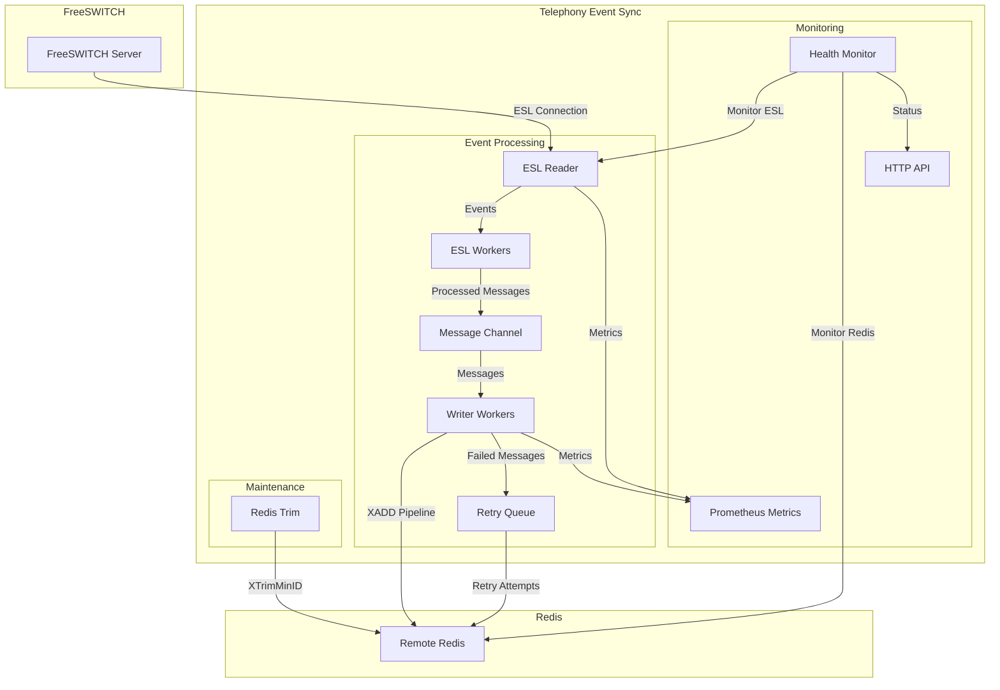
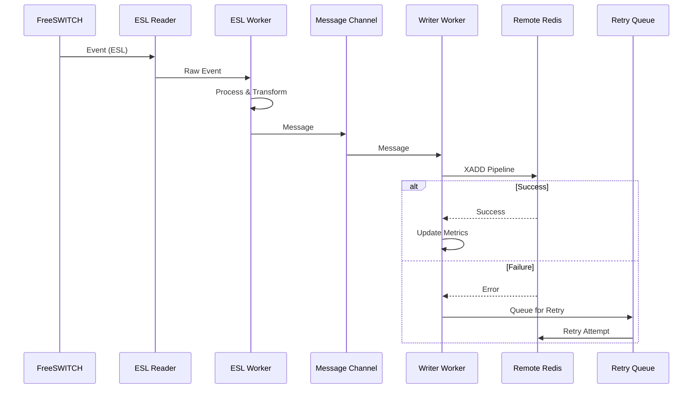

# Telephony Event Sync

A high-performance, ultra-low latency telephony event synchronization service that forwards events from FreeSWITCH to Redis in near real-time with zero data loss and high predictability.

## 🎯 Project Requirements Compliance

This service is designed to meet the following critical requirements:

### ✅ **Ultra-low Latency**

- **Near real-time event forwarding** from FreeSWITCH to Redis
- **Pipeline-based Redis writes** with configurable timeouts (25ms default)
- **Parallel processing** with multiple reader and writer workers
- **Optimized channel buffers** for minimal latency

### ✅ **No Data Loss**

- **Robust retry mechanism** with configurable TTL and max retries
- **Persistent retry queue** with backoff strategy
- **Automatic recovery** from connection failures
- **Dead letter handling** for messages that exceed retry limits

### ✅ **High Predictability**

- **Real-time latency monitoring** with Prometheus metrics
- **Configurable latency thresholds** with alerting
- **Performance metrics** for reader, writer, and total latency
- **Predictable resource usage** with connection pooling

### ✅ **Horizontal Scalability**

- **One instance per FreeSWITCH** architecture
- **Docker containerization** with resource limits
- **Stateless design** for easy scaling
- **Load balancing** through multiple worker pools

### ✅ **Persistent Redis Connection**

- **Automatic reconnection** with exponential backoff
- **Connection pooling** with configurable pool size
- **Keep-alive mechanisms** and health monitoring
- **Retransmission handling** for failed operations

### ✅ **Persistent FreeSWITCH Connection**

- **Automatic ESL reconnection** with configurable delays
- **Health checks** and connection monitoring
- **Recovery mechanisms** for connection failures
- **Event subscription management**

### ✅ **Implementation in Go**

- **Go 1.21+** implementation for high performance
- **Concurrent processing** with goroutines and channels
- **Memory-efficient** design with proper resource management
- **Cross-platform** compatibility

### ✅ **Configuration Support**

- **Environment-based configuration** with sensible defaults
- **Comprehensive validation** of all configuration parameters
- **Runtime configuration** for timeouts, intervals, and limits
- **Template-based** configuration files

### ✅ **Redis Event Management**

- **Automatic stream trimming** with configurable intervals
- **TTL-based expiration** for old events
- **Memory management** through stream length limits
- **Removes dependency** on FreeSWITCH Lua scripts

### ✅ **Robust Error Handling**

- **Custom error types** for different failure scenarios
- **Panic recovery** in all critical goroutines
- **Structured logging** with different log levels
- **Graceful degradation** and recovery

## 🏗️ Architecture Overview

### System Architecture



### Data Flow



## 📁 Project Structure

```txt
src/
├── main.go              # Application entry point and orchestration
├── config.go            # Configuration management and validation
├── metrics.go           # Prometheus metrics and monitoring
├── redis_trim.go        # Redis stream maintenance and trimming
├── esl_reader.go        # ESL event reading and processing
├── redis_writer.go      # Redis writing with pipeline optimization
├── redis.go             # Redis connection management
├── esl.go               # ESL connection and client management
├── health.go            # Health monitoring and recovery
├── retry.go             # Retry mechanism and queue management
├── errors.go            # Custom error types and handling
├── utils.go             # Utility functions and panic recovery
├── types.go             # Data structures and types
├── logger.go            # Structured logging system
└── api_server.go        # HTTP API for health checks and metrics
```

## 🚀 Features

### **Event Processing**

- **ESL (Event Socket Library)** direct connection to FreeSWITCH
- **Real-time event processing** with configurable workers
- **Event filtering** and transformation
- **Batch processing** with pipeline optimization

### **Data Management**

- **Zero data loss** with retry mechanism and persistent queue
- **Automatic stream trimming** to manage memory usage
- **TTL-based expiration** for old events
- **Event ordering preservation**

### **Performance & Scalability**

- **Ultra-low latency** processing pipeline
- **Horizontal scaling** with one instance per FreeSWITCH
- **Connection pooling** for optimal resource usage
- **Parallel processing** with multiple worker pools

### **Monitoring & Observability**

- **Comprehensive Prometheus metrics**
- **Real-time latency monitoring**
- **Health checks** with automatic recovery
- **Structured logging** with different levels

### **Reliability & Resilience**

- **Automatic reconnection** for both ESL and Redis
- **Panic recovery** in all critical components
- **Graceful shutdown** with proper cleanup
- **Error handling** with custom error types

## 📋 Requirements

### **System Requirements**

- **Go 1.21** or higher
- **Redis 7.0** or higher
- **FreeSWITCH** with mod_event_socket enabled

### **Network Requirements**

- **TCP connectivity** to FreeSWITCH ESL port (8021)
- **TCP connectivity** to Redis server
- **HTTP port** for health checks and metrics (9876)

## ⚙️ Configuration

### **Environment Variables**

#### **ESL Configuration**

```env
# ESL Connection Settings
ESL_HOST=localhost                    # FreeSWITCH ESL host
ESL_PORT=8021                        # FreeSWITCH ESL port
ESL_PASSWORD=ClueCon                 # FreeSWITCH ESL password

# ESL Recovery Settings
ESL_RECONNECT_DELAY=3s               # Initial reconnect delay
ESL_MAX_RECONNECT_DELAY=10s          # Maximum reconnect delay
ESL_HEALTH_CHECK_TIMEOUT=3s          # Health check timeout
```

#### **Redis Configuration**

```env
# Redis Remote Connection
REDIS_REMOTE_ADDR=redis.example.com:6379  # Remote Redis address
REDIS_REMOTE_PASSWORD=                    # Redis password (if any)
REDIS_REMOTE_DB=2                        # Redis database number
REDIS_REMOTE_POOL_SIZE=100               # Connection pool size
REDIS_REMOTE_MIN_IDLE_CONNS=20           # Minimum idle connections
REDIS_REMOTE_MAX_RETRIES=3               # Maximum retries

# Redis Timeouts
REDIS_REMOTE_DIAL_TIMEOUT=3s             # Connection timeout
REDIS_REMOTE_WRITE_TIMEOUT=2s            # Write operation timeout
REDIS_REMOTE_POOL_TIMEOUT=5s             # Pool timeout
```

#### **Stream Configuration**

```env
# Stream Names
STREAM_EVENTS=freeswitch:telephony:events        # Events stream
STREAM_JOBS=freeswitch:telephony:background-jobs # Jobs stream

# Stream Settings
EVENTS_MAX_LEN=10000                    # Maximum events stream length
JOBS_MAX_LEN=10000                      # Maximum jobs stream length
EVENTS_EXPIRE_TIME=10m                  # Events expiration time
JOBS_EXPIRE_TIME=1m                     # Jobs expiration time
TRIM_INTERVAL=10s                       # Stream trimming interval
```

#### **Processing Configuration**

```env
# Reader Configuration
READER_WORKERS=3                        # Number of ESL reader workers
READER_MAX_LATENCY=300ms                # Maximum reader latency
READER_BLOCK_TIME=10ms                  # Reader block timeout

# Writer Configuration
WRITER_WORKERS=20                       # Number of writer workers
WRITER_BATCH_SIZE=20                    # Pipeline batch size
WRITER_PIPELINE_TIMEOUT=25ms            # Pipeline execution timeout
WRITER_MAX_LATENCY=300ms                # Maximum writer latency
TOTAL_MAX_LATENCY=500ms                 # Maximum total latency

# Buffer Configuration
BUFFER_SIZE=50000                       # Channel buffer size

# Retry Configuration
WRITER_MAX_RETRIES=3                    # Maximum retry attempts
WRITER_RETRY_QUEUE_SIZE=10000           # Retry queue size
WRITER_RETRY_PAUSE_AFTER=100ms          # Pause between retries
WRITER_RETRY_TTL=5s                     # Retry TTL
```

#### **Event Configuration**

```env
# Events to Process
EVENTS_TO_PUBLISH=BACKGROUND_JOB,CHANNEL_EXECUTE,CHANNEL_EXECUTE_COMPLETE,DTMF,DETECTED_SPEECH
EVENTS_TO_PUSH=CHANNEL_ANSWER,CHANNEL_HANGUP,DTMF,CUSTOM
```

#### **Monitoring Configuration**

```env
# Health Check
HEALTH_CHECK_INTERVAL=5s                # Health check interval
HEALTH_MAX_RETRIES=100                  # Maximum health failures
HEALTH_PORT=9876                        # Health check port

# Metrics
METRICS_PRINT_INTERVAL=5s               # Metrics print interval
```

## 🐳 Docker Deployment

### **Docker Compose**

```yaml
version: '3.8'

services:
  telephony-sync:
    build:
      context: .
      dockerfile: Dockerfile
    env_file:
      - .env
    volumes:
      - /var/run/telephony:/var/run/telephony
    ports:
      - "${HEALTH_PORT:-9876}:9876"
    network_mode: host
    restart: unless-stopped
    user: "${UID:-1000}:${GID:-1000}"
    healthcheck:
      test: ["CMD", "wget", "--spider", "-q", "http://localhost:9876/health"]
      interval: 30s
      timeout: 3s
      retries: 3
      start_period: 5s
    deploy:
      resources:
        limits:
          cpus: '1'
          memory: 1G
        reservations:
          cpus: '0.5'
          memory: 512M
```

### **Docker Build**

```bash
docker build -t telephony-event-sync .
docker run -d --name telephony-sync telephony-event-sync
```

## 📊 Monitoring & Metrics

### **Prometheus Metrics**

#### **Performance Metrics**

- `telephony_messages_processed_total` - Total messages processed
- `telephony_errors_total` - Total errors encountered
- `telephony_reader_latency_milliseconds` - Reader latency histogram
- `telephony_writer_latency_milliseconds` - Writer latency histogram
- `telephony_total_latency_milliseconds` - Total latency histogram

#### **Connection Metrics**

- `telephony_esl_connections_total` - Active ESL connections
- `telephony_esl_reconnections_total` - ESL reconnection count
- `telephony_redis_connections_total` - Active Redis connections
- `telephony_redis_reconnections_total` - Redis reconnection count

### **Health Check Endpoint**

```bash
curl http://localhost:9876/health
```

**Response (Healthy):**

```json
{
    "status": "healthy",
    "data": {
        "last_heartbeat": "2024-01-15T10:00:00Z",
        "last_error": null,
        "recovery_attempts": 0,
        "is_healthy": true,
        "last_check": "2024-01-15T10:00:00Z"
    }
}
```

### **Logs**

The service provides structured logging with different levels:

- **INFO**: General operational information
- **DEBUG**: Detailed debugging information
- **WARN**: Warning messages
- **ERROR**: Error messages with context

## 🔧 Development

### **Building from Source**

```bash
git clone https://github.com/your-repo/telephonyEventSync.git
cd telephonyEventSync
go build -o telephony-sync src/*.go
```

### **Running Locally**

```bash
# Set environment variables
export ESL_HOST=localhost
export ESL_PORT=8021
export REDIS_REMOTE_ADDR=localhost:6379

# Run the service
./telephony-sync
```

### **Testing**

```bash
# Run tests
go test ./src/...

# Run with race detection
go test -race ./src/...

# Run benchmarks
go test -bench=. ./src/...
```

## 🚨 Troubleshooting

### **Common Issues**

#### **ESL Connection Failures**

- Verify FreeSWITCH is running and mod_event_socket is enabled
- Check ESL host, port, and password configuration
- Ensure network connectivity to FreeSWITCH

#### **Redis Connection Issues**

- Verify Redis server is running and accessible
- Check Redis address, password, and database configuration
- Ensure network connectivity to Redis

#### **High Latency**

- Monitor channel buffer sizes
- Check Redis performance and network latency
- Adjust worker counts and batch sizes

#### **Memory Issues**

- Monitor stream lengths and trim intervals
- Check for memory leaks in long-running instances
- Adjust buffer sizes and connection pools

### **Debug Mode**

Enable debug logging for detailed troubleshooting:

```bash
export LOG_LEVEL=debug
./telephony-sync
```

## 📈 Performance Tuning

### **Optimization Guidelines**

#### **For High Throughput**

- Increase `WRITER_WORKERS` and `READER_WORKERS`
- Increase `BUFFER_SIZE` for high event rates
- Optimize `WRITER_BATCH_SIZE` for your Redis performance

#### **For Low Latency**

- Decrease `WRITER_PIPELINE_TIMEOUT`
- Optimize `READER_BLOCK_TIME`
- Monitor and adjust `TOTAL_MAX_LATENCY`

#### **For Memory Efficiency**

- Decrease `EVENTS_MAX_LEN` and `JOBS_MAX_LEN`
- Increase `TRIM_INTERVAL` for less frequent trimming
- Monitor connection pool sizes

## 🤝 Contributing

1. Fork the repository
2. Create a feature branch
3. Make your changes
4. Add tests for new functionality
5. Ensure all tests pass
6. Submit a pull request

## 📄 License

This project is licensed under the MIT License - see the [LICENSE](LICENSE) file for details.

## 🆘 Support

For support and questions:

- Create an issue in the GitHub repository
- Check the troubleshooting section
- Review the configuration documentation

---

**Telephony Event Sync** - Ultra-low latency, zero data loss telephony event synchronization for FreeSWITCH to Redis.
