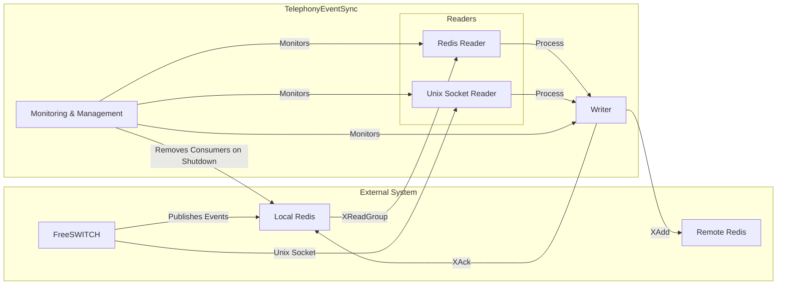
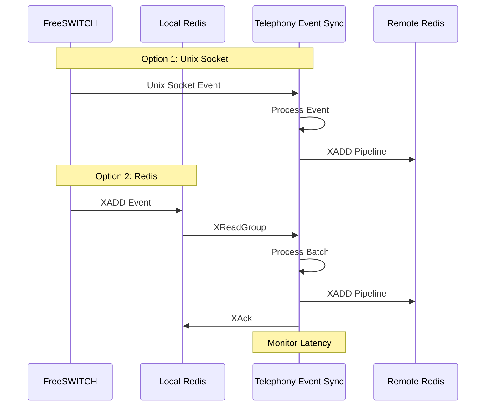
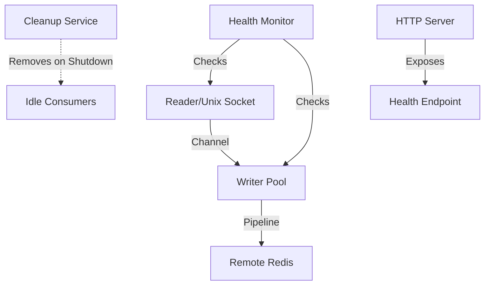

# Telephony Event Sync

High-performance telephony event synchronization service between Redis instances, optimized for low latency and high throughput.

## Reading Alternatives

The service supports two different ways to receive events from FreeSWITCH:

### 1. Unix Socket (Recommended for Low Latency)

In this mode, FreeSWITCH writes events directly to a Unix socket, which are then read by the service. This provides the lowest possible latency as it eliminates the Redis local step.


Required configuration:

```env
READER_TYPE=unix
UNIX_SOCKET_PATH=/var/run/telephony/telephony.sock
```

FreeSWITCH configuration (in `lua.conf.xml`):

```xml
<!-- GO CONTACT EVENTS -->
<hook event="BACKGROUND_JOB" script="send-events.lua"/>
<hook event="CHANNEL_EXECUTE" script="send-events.lua"/>
<hook event="CHANNEL_EXECUTE_COMPLETE" script="send-events.lua"/>
<hook event="CHANNEL_ANSWER" script="send-events.lua"/>
<hook event="CHANNEL_HANGUP" script="send-events.lua"/>
<hook event="DTMF" script="send-events.lua"/>
<hook event="DETECTED_SPEECH" script="send-events.lua"/>
<hook event="CUSTOM" subclass="fscontact::inbound" script="send-events.lua"/>
<hook event="CUSTOM" subclass="fscloud-tone-detection" script="send-events.lua"/>
<!-- GO CONTACT EVENTS -->
```

### 2. Redis Local

In this mode, FreeSWITCH writes events to a local Redis instance, which are then read by the service using Redis Streams.


Required configuration:

```env
READER_TYPE=redis
REDIS_LOCAL_ADDR=localhost:6379
REDIS_LOCAL_DB=2
REDIS_GROUP=sync_group
REDIS_CONSUMER=sync_worker
```

## Architecture

### System Overview



### Processing Flow



### Component Architecture



## Features

- Real-time FreeSWITCH event synchronization between Redis instances
- Support for both Redis and Unix Socket event sources
- Low-latency event processing with batch optimization
- Parallel processing with multiple writer workers
- Comprehensive latency monitoring
- Automatic consumer cleanup on service shutdown
- Health checks and metrics
- Graceful shutdown
- Protection against overload
- Automatic stream trimming

## Requirements

- Go 1.21 or higher
- Redis 6.0 or higher
- FreeSWITCH with mod_event_socket

## Configuration

The service is configured through environment variables:

### Reader Configuration

```env
# Choose between "redis" or "unix" (default: "redis")
READER_TYPE=redis

# Unix Socket configuration (only used when READER_TYPE=unix)
UNIX_SOCKET_PATH=/var/run/telephony/telephony.sock  # Unix socket path
```

### Redis Local Configuration (only used when READER_TYPE=redis)

```env
REDIS_LOCAL_ADDR=localhost:6379    # Local Redis address
REDIS_LOCAL_DB=2                   # Local Redis database number
REDIS_LOCAL_PASSWORD=              # Local Redis password (if any)
REDIS_LOCAL_POOL_SIZE=100          # Local Redis connection pool size
REDIS_LOCAL_MIN_IDLE_CONNS=10      # Minimum idle connections in pool
REDIS_LOCAL_MAX_RETRIES=3          # Maximum retries for failed operations
```

### Redis Remote Configuration

```env
REDIS_REMOTE_ADDR=redis.qa-uc-cloud1.gocontact.internal:6379  # Remote Redis address
REDIS_REMOTE_DB=2                 # Remote Redis database number
REDIS_REMOTE_PASSWORD=            # Remote Redis password (if any)
REDIS_REMOTE_POOL_SIZE=100        # Remote Redis connection pool size
REDIS_REMOTE_MIN_IDLE_CONNS=10    # Minimum idle connections in pool
REDIS_REMOTE_MAX_RETRIES=3        # Maximum retries for failed operations
```

### Redis Consumer Group Configuration (only used when READER_TYPE=redis)

```env
REDIS_GROUP=sync_group            # Redis consumer group name
REDIS_CONSUMER=sync_worker        # Base consumer name (will be appended with hostname and ID)
```

### Stream Configuration

```env
# Stream names
STREAM_EVENTS=freeswitch:telephony:events        # Main events stream
STREAM_JOBS=freeswitch:telephony:background-jobs # Background jobs stream

# Stream settings
EVENTS_MAX_LEN=10000              # Maximum length of events stream
JOBS_MAX_LEN=10000               # Maximum length of jobs stream
EVENTS_EXPIRE_TIME=10m           # Events expiration time
JOBS_EXPIRE_TIME=1m             # Jobs expiration time
TRIM_INTERVAL=10s               # Interval for stream trimming
```

### Processing Configuration

```env
# Reader configuration
READER_WORKERS=10                # Number of parallel reader workers
READER_BATCH_SIZE=1000           # Number of messages to read at once
READER_MAX_LATENCY=300ms         # Maximum acceptable read latency
READER_BLOCK_TIME=10ms           # Block time for XReadGroup operation

# Buffer configuration
BUFFER_SIZE=100000               # Size of the channel buffer between reader and writers

# Writer configuration
WRITER_WORKERS=10                # Number of parallel writer workers
WRITER_PIPELINE_TIMEOUT=25ms     # Pipeline execution timeout
WRITER_BATCH_SIZE=10             # Number of messages per pipeline
WRITER_MAX_LATENCY=300ms         # Maximum acceptable write latency
TOTAL_MAX_LATENCY=1000ms         # Maximum acceptable total latency (from event to remote)
```

### Health Check Configuration

```env
HEALTH_CHECK_INTERVAL=5s         # Interval between health checks
HEALTH_RECOVERY_TIMEOUT=30s      # Timeout for recovery attempts
HEALTH_MAX_RETRIES=5             # Maximum consecutive failures before unhealthy
HEALTH_PORT=8080                 # Port for health check endpoint
```

## Monitoring

The service provides comprehensive monitoring capabilities:

### Metrics

- Messages processed per interval
- Queue size
- Read latency
- Write latency
- Total event latency (from FreeSWITCH to remote Redis)
- Error counts
- Consumer status

### Health Check

HTTP endpoint for health verification:

```txt
GET /health
```

Response:

```json
{
    "status": "healthy",
    "last_sync": "2024-03-21T10:00:00Z",
    "queue_size": 0,
    "errors": 0
}
```

### Logs

- Connection errors
- Processing errors
- High latency warnings
- Cleanup status
- Metrics every 5 seconds
- Consumer lifecycle events

## Performance Optimizations

The service implements several optimizations:

1. **Batch Processing**:
   - Reads multiple messages at once
   - Uses Redis pipeline for writes
   - Configurable batch sizes

2. **Parallel Processing**:
   - Multiple writer workers
   - Non-blocking channel operations
   - Efficient resource utilization
   - Optimized metrics updates

3. **Memory Management**:
   - Pre-allocated buffers
   - Efficient string to bytes conversion
   - Reduced memory allocations
   - Optimized map operations

4. **Overload Protection**:
   - Buffered channels
   - Non-blocking operations
   - Configurable timeouts

5. **Stream Management**:
   - Automatic stream trimming
   - Configurable max lengths
   - Configurable expiration times

## Build and Execution

### Local Build

```bash
# Build
go build -o telephonyEventSync

# Execution
./telephonyEventSync
```

### Docker

```bash
# Build image
docker compose build

# Run container
docker compose up -d
```

## Troubleshooting

### Common Issues

1. **High Latency**:
   - Check network connectivity
   - Verify Redis performance
   - Adjust batch sizes
   - Monitor system resources

2. **Connection Errors**:
   - Verify Redis credentials
   - Check network connectivity
   - Adjust connection pool settings
   - Monitor Redis logs

3. **Lost Messages**:
   - Check buffer size
   - Monitor queue size
   - Adjust worker count
   - Verify consumer group status
   - Check stream trimming settings

### Monitoring Tools

1. **Redis CLI**:

   ```bash
   # Check consumer group
   XINFO GROUPS <stream>

   # Check pending messages
   XPENDING <stream> <group>

   # Check stream length
   XLEN <stream>
   ```

2. **Metrics**:

```bash
# Check metrics endpoint
curl http://localhost:8080/metrics
```

## Contributing

1. Fork the project
2. Create your feature branch (`git checkout -b feature/amazing-feature`)
3. Commit your changes (`git commit -m 'Add amazing feature'`)
4. Push to the branch (`git push origin feature/amazing-feature`)
5. Open a Pull Request
